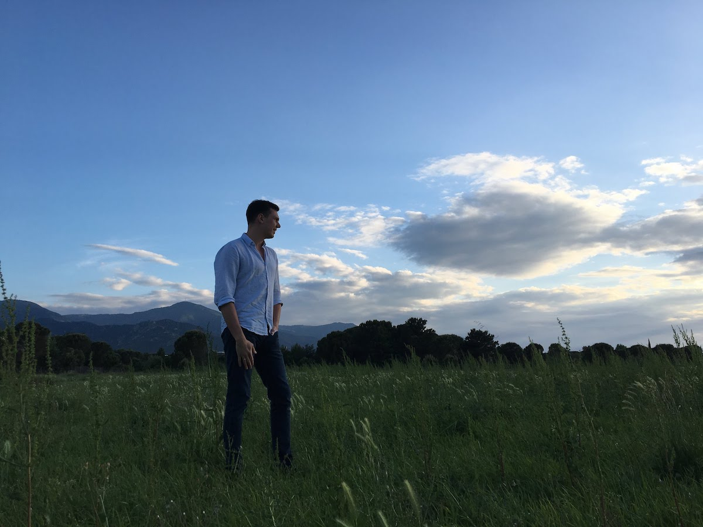

Since 2007, I have been involved into various software projects of different scale and worked for different organizations, small and large.

## Areas of Interest
The best application of my skills so far has been the area where software engineering, product mindset, and critical thinking overlap.

Turns out, it’s usually about accumulating deep insights in some field and using them to tackle meaningful business challenges with software, supporting engineers in doing their best, and communicating a lot.

Aside from those ‘softer’ skills, I’m experienced in a few major fields.

- **Design, development, and maintenance of web projects** through their entire life cycle, with the emphasis on full-stack JavaScript development.
- **Engineering management of teams** supporting critical, revenue-generating business domains, up to 12 people large, while being deeply involved and responsible for people, product, architecture and technology stack, and ultimately delivery on time.
- **Digital marketing** with the focus on the conversion analysis and optimization and respect to user experience, web application performance, and SEO.

In my free time, I enjoy studying advanced math, helping people understand technology, and having fun with my family.
