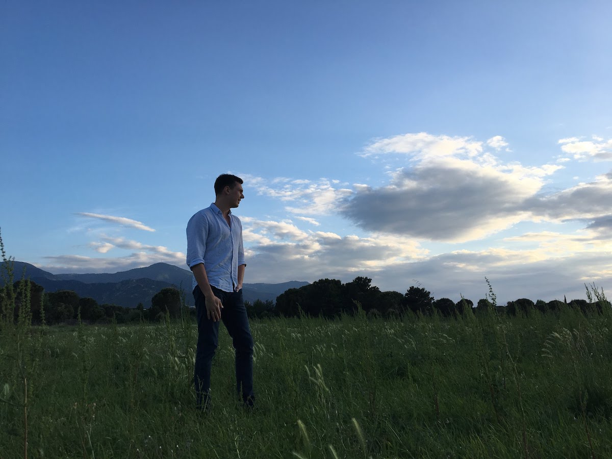

Hi there,

I’m Oleg Gromov. I mostly write about my experience in software development, managing people, and education.

Since 2007, I have been involved into various software projects of different scale and worked for different organizations, small and large.

## Areas of Interest
The best application of my skills so far has been the area where software engineering, product mindset, and critical thinking overlap.

Turns out, it’s usually about accumulating deep insights in some field and using them to tackle meaningful business challenges with software, supporting engineers in doing their best, and communicating a lot.

Aside from those ‘softer’ skills, I’m experienced in full-stack JavaScript development, digital marketing, data science and statistics, and a bit of mathematical modeling.

In my free time, I enjoy studying advanced math, helping people understand technology, and taking care of my family.
